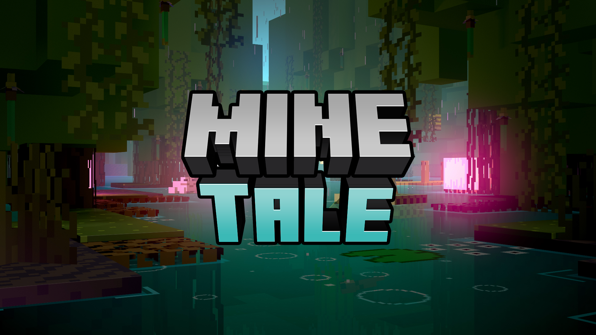

# MineTale
Hey! Welcome to the official GitHub for the MineTale Server, an upcoming Brazilian experience!

## What is MineTale?
It's a project that's at the development since 2020. It consists of an RPG with skills and custom abilities, custom bosses, custom stats, custom items, and much more.
You should be able to do anything you want in this world: explore, kill monsters and help the village's habitants because you control the story.

## How do I see how it's turning out?
You can enter our Discord [here](https://discord.gg/QsQ5zC24Yd). On the `#spoilers` channel, you'll see sneak peeks, screenshots, and videos from the developer itself.
Also, feel free to suggest something or report bugs when the server is open!
